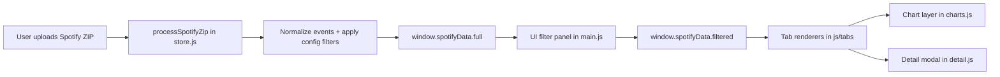

# Spotify Stats Analyzer

A full-featured, client-side analytics dashboard for Spotify Extended Streaming History exports, with advanced behavioral analysis, F1-style ranking systems, session/chaining intelligence, interactive filtering, and deep per-entity drill-down.

## Table of Contents

1. [Project Overview](#project-overview)
2. [Data Sources and Input Contracts](#data-sources-and-input-contracts)
3. [Architecture and System Design](#architecture-and-system-design)
4. [ETL and Analytics Pipeline](#etl-and-analytics-pipeline)
5. [State Management, Filters, and Interaction Model](#state-management-filters-and-interaction-model)
6. [Detailed Feature Breakdown by Tab](#detailed-feature-breakdown-by-tab)
7. [Visualization Layer](#visualization-layer)
8. [Data Engineering Details](#data-engineering-details)
9. [Machine Learning and Advanced Analytics Notes](#machine-learning-and-advanced-analytics-notes)
10. [Technical Stack](#technical-stack)
11. [How to Run the Project](#how-to-run-the-project)
12. [Configuration and Tuning Parameters](#configuration-and-tuning-parameters)
13. [Performance Characteristics](#performance-characteristics)
14. [Limitations and Known Issues](#limitations-and-known-issues)
15. [Security and Privacy Notes](#security-and-privacy-notes)
16. [Future Improvements](#future-improvements)
17. [Project Structure Reference](#project-structure-reference)

---

## Project Overview

### What this application does

Spotify Stats Analyzer ingests a Spotify "Extended streaming history" ZIP export and builds an interactive multi-tab analytics experience over your complete listening timeline. It transforms raw event-level playback logs into:

- KPI dashboards
- temporal and behavioral distributions
- streak and gap analysis
- ranking systems (including Formula 1-inspired championship scoring)
- discovery and loyalty insights
- exploratory raw-history tools
- comparative artist-versus-artist intelligence
- annual "Wrapped" narratives
- quiz/game mechanics derived from your own data

### Target users

- Personal analytics users who want deeper insight than Spotify's standard yearly summary
- Data enthusiasts who want to inspect listening behavior at event granularity
- Users interested in longitudinal trends across multiple years
- Power users who want configurable skip detection, streak thresholds, and ranking logic

### Problem solved

Spotify exports are raw JSON event streams that are difficult to inspect at scale. This project solves:

- high-friction manual analysis of large JSON history archives
- lack of custom definitions (skip logic, minimum play threshold)
- inability to perform cross-sectional and longitudinal filtering interactively
- lack of rich drill-down from aggregate charts into entity-level detail

### Delivery model

The main product is a browser-based static app. Data processing happens in-memory in the client, so uploads are not transmitted to a backend service.

A secondary Streamlit script (`app.py`) exists as an alternative/prototype workflow.

---

## Data Sources and Input Contracts

### Primary source

Spotify Extended Streaming History ZIP export containing JSON files such as:

- `endsong_*.json`
- `Streaming_History_Audio_*.json`
- `Streaming_History_Video_*.json`

### Parsed fields (normalized model)

The pipeline maps each record into a canonical event object with fields including:

- `ts` (parsed timestamp)
- `date` (local `YYYY-MM-DD`)
- `trackName`, `artistName`, `albumName`
- podcast-specific `episodeName`, `episodeShowName`
- `isPodcast`
- `msPlayed`, `durationMin`
- `year`, `month`, `hour`, `weekday`
- `reasonStart`, `reasonEnd`
- `platform` (normalized label)
- `country`
- `season`, `timeOfDay`
- `skipped` (derived by configurable policy)

### Input assumptions

- JSON files contain Spotify event objects with `ts` and play duration information
- corrupted JSON or invalid timestamps are dropped
- entries below configured minimum play time are discarded

### Not used in primary runtime

- No GPX, CSV, or external APIs are required for the browser dashboard
- Optional external script in `index.html` references Crazy Egg (analytics script)

---

## Architecture and System Design

### High-level architecture

The production app is a modular, client-side architecture:

- `index.html`: shell, tab layout, controls, canvas targets
- `js/main.js`: bootstrap, ingestion trigger, filters, tab routing
- `js/store.js`: core data processing + metric/insight computation engine
- `js/charts.js`: chart rendering adapters (Chart.js wrappers)
- `js/ui.js`: top-level rendering orchestration
- `js/detail.js`: entity modal drill-down and chart rendering
- `js/tabs/*.js`: per-tab presentation + interactions

### Data flow



### Module responsibilities

- `store.js`
  - deterministic analytics and aggregations
  - reusable computation primitives shared by all tabs
  - no direct DOM mutation
- `tabs/*`
  - translate store outputs into HTML and chart invocations
  - handle tab-local controls and user actions
- `main.js`
  - global controls, filter lifecycle, tab activation/lazy render, reset flow
- `charts.js`
  - Chart.js instance lifecycle (`destroy`/recreate pattern)
  - consistent palette, axis styles, tooltip formatting

### Interaction model

- Global filters alter `window.spotifyData.filtered`
- Most tabs recompute against filtered dataset
- Detail modal opens from clickable rows/cards and computes against full dataset for context richness

### API/auth/rate limit/caching/pagination

- External API calls: none for analytics core
- Authentication: none required
- Rate limits: not applicable
- Caching:
  - browser app: no persistent cache, in-memory only
  - Streamlit prototype: uses `@st.cache_data` for weekly ranking computation
- Pagination:
  - Explorer table paginates client-side (`PAGE_SIZE = 200`)

---

## ETL and Analytics Pipeline

This project follows a clear in-browser ETL pattern.

### 1. Ingestion

`processSpotifyZip` (`store.js`):

- opens ZIP with JSZip
- scans entries for supported Spotify history filename patterns
- parses each JSON payload and concatenates arrays

### 2. Cleaning

`processEntry` (`store.js`) applies strict filtering:

- reject if `ms_played < minPlayMs`
- reject invalid timestamps
- reject based on config flags:
  - podcasts off
  - offline plays off
  - incognito plays off

### 3. Transformation

For each retained entry:

- timestamp decomposition to year/month/hour/weekday/date
- season and time-of-day derivation
- platform normalization (device class mapping)
- skip classification using configurable policy:
  - by reason
  - by duration threshold
  - or combined

### 4. Feature extraction

Examples implemented in `store.js`:

- KPI features: totals, uniques, active days, average/day, skip rate
- temporal buckets: day/week/month/year aggregates
- distribution vectors: hour, weekday, month, season, platform, country, reasons
- sequence/session features: transitions and session segmentation by inactivity gap
- competition features: F1-style points, podiums, streaks, fastest laps
- comparison features: overlap metrics, duel points, quantile distributions

### 5. Visualization delivery

Tab modules request derived datasets and route them into Chart.js render functions, with interactive controls triggering recomputation.

---

## State Management, Filters, and Interaction Model

### Global state

`window.spotifyData`:

- `full`: immutable canonical processed timeline after upload
- `filtered`: current working subset after active filters

### Configuration state (pre-ingestion)

Read from upload settings and injected into store config:

- minimum counted play duration
- skip detection mode and threshold
- top-N sizes
- streak gap threshold
- include/exclude podcasts/offline/incognito
- F1 minutes-vs-plays weight

### Filter dimensions (post-ingestion)

- date range (`from`, `to`)
- year
- season
- platform
- country
- time of day
- skip state (all/completed/skipped)
- multi-select entities: artists, albums, tracks (with search)

### Filter processing

`applyFilters` in `main.js` performs deterministic predicate filtering and then triggers full rerender of dependent tabs.

### UX controls around filters

- searchable multi-selects with retained selections during search
- active filter pills with one-click removal
- panel collapse/expand mechanics

---

## Detailed Feature Breakdown by Tab

## Overview

### What user sees

- KPI card grid
- quick-facts cards
- timeline chart (daily/weekly/monthly/yearly)
- top tracks/artists/albums tables with sortable metrics and top-N controls

### Data used

Filtered music events (`!isPodcast && trackName`).

### Transformations and algorithms

- `calculateGlobalKPIs`
- `calculateTopItems` with optional metric:
  - plays
  - minutes
  - F1-derived points
- timeline via `calculateAggregatedTimeline`
- quick-facts custom computations (peak hour/day, one-hit ratio, weekend share)

### Insights delivered

- broad scale and intensity of listening behavior
- concentration and replay behavior
- comparative ranking shifts by selected metric

### Interactive elements

- timeline aggregation toggle
- top-N buttons (10/25/50)
- sort selectors per top list
- row click opens detail modal

## Trends

### What user sees

- listening clock (polar)
- weekday/month/season distributions
- start/end reason distributions
- platform/country distributions
- yearly evolution
- skip-rate trend chart with granularity controls
- weekday-hour heatmap bubble plot

### Data used

Filtered full dataset (music + podcast where relevant to generic dimensions).

### Transformations

- `calculateTemporalDistribution`
- `calculateSeasonDistribution`
- `calculateDistributionPercent`
- `calculateSkipRateTrend`
- `calculateWeekdayHourMatrix`

### Insights delivered

- when/where/on-what-device listening occurs
- behavior around starts/ends/skips
- macro temporal rhythm and seasonality

### Interactivity

- skip trend granularity: day/week/month/year
- tooltips expose counts and percentages

## Streaks

### What user sees

- hero cards for longest/current streak and best periods
- milestone badges
- calendar heatmap with year selector
- top streaks and longest absence lists for artists/tracks/albums

### Data used

Filtered dataset and date-level calendar aggregates.

### Transformations

- `calculateListeningStreaks`
- `calculateArtistDailyStreaks`, `calculateTrackDailyStreaks`, `calculateAlbumDailyStreaks`
- `calculateArtistGapStreaks`, `calculateTrackGapStreaks`, `calculateAlbumGapStreaks`
- `calculateBestPeriods`
- `buildCalendarData`

### Insights delivered

- consistency patterns
- comeback gaps for top entities
- best-day/week/month/year performance windows

### Interactivity

- calendar year navigation
- expandable streak and gap views

## Deep Dive

### What user sees

- behavior cards (personality, loyalty, hidden gems, skipped tracks, replay kings)
- diversity over time bars
- listening habits summary
- chain analysis sections
- session pattern analysis

### Data used

Filtered music events and sessionized sequence data.

### Transformations

- `calculateDeepInsights`
- `calculateListeningChains`
- `calculateListeningSessions`

### Algorithms behind insights

- loyalty: distinct-year coverage by artist
- hidden gems: plays >= 20 and avg duration < 2.5 min
- abandoned tracks: high skip rate with minimum play count
- replay kings: same track repeated >= 3 times/day
- chain transitions: previous-to-next transitions within <= 30 min gaps
- sessionization: contiguous plays under inactivity threshold

### Interactivity

- many list rows are detail-clickable to open entity modal

## F1 Championship

### What user sees

- championship mode selector (artists/tracks/albums)
- season selector
- score weight slider (minutes vs plays)
- standings table with sortable columns
- week-by-week top-10 inspection
- evolution charts (monthly/weekly cumulative)
- all-time records and yearly podium table

### Data used

Filtered music events grouped weekly.

### Transformations and scoring

- `calculateF1Championship`
- weekly rank score:
  - normalize minutes and plays per week
  - weighted composite score
- F1 points map: `[25,18,15,12,10,8,6,4,2,1]`
- fastest-lap bonus:
  - largest single-session play in week
  - bonus applies only if entity is in weekly top 10

### Insights delivered

- season and all-time dominance
- contender consistency and streaks
- weekly competition context and turning points

### Interactivity

- mode/year/week navigation
- sortable standings/all-time/week tables
- dynamic weight slider with immediate recomputation

## Wrapped

### What user sees

- yearly story hero metrics
- trend pills vs previous year
- persona, peak, consistency/discovery cards
- quarter momentum, daypart DNA, monthly new-artist rhythm
- top songs/artists/albums lists
- monthly chart

### Data used

Selected year from full dataset.

### Transformations

- `calculateWrappedStats`
- year-over-year deltas
- quarter splits and half-year comparisons
- streak and concentration metrics
- discovery percentages vs previously seen artists/tracks

### Insights delivered

- compact narrative summary of a selected year
- growth/decline vs previous year
- taste concentration and behavior profile

### Interactivity

- wrapped year selector
- clickable top lists open detail modal

## Game

### What user sees

Four quiz modes:

- Higher or Lower
- Guess the Year
- Complete the Chain
- First Listen Order

### Data used

`window.spotifyData.full` (primarily music entries).

### Transformations

- pulls top entities and chain transitions from store
- builds randomized challenge sets with correctness scoring
- tracks score, streak, accuracy, best streak

### Insights delivered

- gamified self-validation of listening knowledge

### Interactivity

- mode/category/round setup
- per-round choice buttons
- end-screen with stats and replay options

## Explorer

### What user sees

- explorer summary stats
- discovery timeline bars
- recent listening sessions
- full streaming history table with search/sort/filter/pagination
- CSV export

### Data used

Filtered music dataset.

### Transformations

- sessionization via `calculateListeningSessions`
- first-play discovery derivation by entity key
- client-side table operations with page windowing

### Insights delivered

- row-level auditability and exportability
- session-level context on top of event logs

### Interactivity

- search input and sort selectors
- completed/skipped filter
- page controls
- CSV export action

## Viewer

### What user sees

Animated progression/race chart system for top entities over time.

### Data used

Filtered music dataset with user-selected parameters.

### Transformations

- `calculateViewerAccumulatedSeries`
- supports:
  - entity: artist/album/track
  - metric: minutes/plays/points
  - value mode: accum/rolling/period/simple
  - granularity: day/week/month/year
  - date range and top-X

### Insights delivered

- trajectory dominance changes over time
- ranking dynamics and accumulation behavior

### Interactivity

- build/play/pause/reset
- speed slider
- scrubber + step navigation
- chart mode line/bar
- lock camera scaling option

## Podcasts

### What user sees

- podcast KPI grid
- top shows and top episodes charts
- podcast timeline with granularity controls
- hour/weekday charts
- yearly growth bars
- replayed episodes, binge days, discovered shows lists

### Data used

Podcast entries (`isPodcast` or episode/show fields).

### Transformations

- show and episode aggregations
- completion rates
- listening streaks and active-day summaries
- timeline grouping day/week/month/year

### Insights delivered

- podcast-specific consumption profile
- show loyalty, binge behavior, replay tendencies

### Interactivity

- chart click-to-show-detail
- timeline granularity toggles
- clickable show/episode lists

## Compare

### What user sees

- artist A vs artist B selector
- head-to-head and weighted winner hero cards
- metric-by-metric verdict table with weights
- cumulative race chart and comparative profile charts
- recent weekly duel table
- overlap/platform/timeline extras

### Data used

Filtered music entries for selected artists.

### Transformations

- `calculateArtistComparison`
- summary feature vectors for each artist
- weekly duel scoring (3/1/0 style)
- overlap (shared/exclusive tracks/albums, Jaccard-like percentages)
- weighted rule-based verdict engine
- distribution quantiles for session-like daily minutes

### Insights delivered

- objective side-by-side profile and winner framing
- ability to tune verdict via metric weighting

### Interactivity

- random similar pair selection
- strict winner mode
- metric weight editing and reset
- race metric switching (minutes/plays/points)

## Calendar

### What user sees

- year/month/week calendar modes
- heat/intensity coloring by plays/day
- period stats ribbon
- per-day detail drawer with full event list

### Data used

Filtered dataset mapped to date-indexed aggregates.

### Transformations

- `buildDayMap`-style day aggregation in tab module
- period summaries: plays, duration, active days, unique entities
- day detail includes track/podcast names, reason start/end, durations

### Insights delivered

- calendar-native view of consistency and burst days
- high-resolution daily audit trail

### Interactivity

- prev/next/today navigation
- year/month/week toggles
- day-click detail overlay

---

## Visualization Layer

### Core library

Chart.js v4 with:

- `chartjs-plugin-datalabels`
- `chartjs-adapter-date-fns`

### Visual primitives used

- line charts (timelines, evolution curves)
- bar charts (top lists, grouped comparisons)
- doughnut charts (reason/platform distributions)
- polar area (hour clock)
- bubble chart (weekday-hour density)

### Interactivity model

- hover tooltips with computed context
- dynamic chart recreation to prevent stale instances
- clickable list/chart items feeding detail modal
- control-driven re-render (granularity, top-N, metric mode)

### Why these visual choices are useful

- bars for ranking clarity and magnitude comparison
- lines for temporal progression and trend continuity
- doughnut/polar for proportional and cyclical interpretation
- bubble matrix for quick hotspot detection in periodic behavior

---

## Data Engineering Details

### Cleaning steps

- invalid timestamps removed
- entries below minimum duration removed
- optional exclusion of podcast/offline/incognito events
- null/empty entity names filtered in entity-level ranking paths

### Missing values and null handling

- unknown platform/country/reason values mapped to fallback labels
- track/album/artist nulls excluded from relevant computations
- defensive defaults avoid divide-by-zero issues

### Noise handling

- session boundary threshold (default 30 min) reduces artificial cross-session transitions
- skip detection configurable by reason, time threshold, or union of both

### Aggregations

- daily, weekly (Monday-start), monthly, yearly rollups
- per-entity grouped stats (plays, minutes, skips, points)
- per-bucket distribution percentages

### Rolling windows and smoothing

Viewer tab supports rolling-mean mode with configurable window to smooth noisy period signals.

### Normalization

F1 scoring normalizes weekly plays and minutes before weighted blending:

- $score = w_{min} \cdot \frac{minutes}{max(minutes)} + w_{play} \cdot \frac{plays}{max(plays)}$

### Domain-specific metrics implemented

- skip rate
- active-day intensity
- streak lengths and longest absences
- year-over-year deltas
- overlap percentages and weighted comparison verdicts
- fastest-lap weekly bonus in F1 mode

---

## Machine Learning and Advanced Analytics Notes

### Current status

No predictive machine learning models are currently implemented.

### What exists instead

A robust rules-based and statistics-driven analytics layer provides:

- ranking engines
- weighted scoring systems
- distributional profiling
- sequence/session mining
- comparative scorecards

### Explicitly not implemented (today)

- regression forecasting
- clustering/PCA embeddings
- SHAP/feature attribution
- survival/churn modeling

### Recommended ML extensions (future)

- next-track recommendation baseline with Markov models
- temporal demand forecasting for listening volume
- unsupervised taste segmentation (artist/genre vectors)
- anomaly detection for unusual listening periods

---

## Technical Stack

### Frontend

- HTML5/CSS3/JavaScript (ES modules)
- Chart.js + plugins
- JSZip for client-side ZIP parsing
- WordCloud2.js (word cloud capability)

### Backend

- None required for browser app

### Optional/legacy analytics app

- Streamlit (`app.py`)
- pandas, matplotlib, seaborn, plotly

### Deployment model

- static-site compatible (any static file host)
- local run via lightweight static server

---

## How to Run the Project

## Option A: Main browser dashboard (recommended)

### Prerequisites

- modern browser (Chrome/Edge/Firefox)
- local static server (recommended for module/script compatibility)

### Steps

1. Clone or download this repository.
2. Start a static server from project root:

```bash
python -m http.server 8000
```

1. Open:

```text
http://localhost:8000
```

1. Upload your Spotify Extended Streaming History ZIP from the landing screen.

## Option B: Streamlit prototype (`app.py`)

### Prerequisites

- Python 3.9+

### Install dependencies

```bash
pip install -r requirements.txt
```

### Run

```bash
streamlit run app.py
```

### Note

The Streamlit app and browser app are separate implementations. The browser app is the primary, feature-complete experience.

---

## Configuration and Tuning Parameters

Upload-time settings control ingestion semantics:

- `Minimum play time to count` (seconds)
- `Skip detection method`:
  - reason-only
  - time-only
  - both
- `Skip time threshold` (seconds)
- `Top lists size`
- `Listening streak gap` (days)
- `F1 score weight` (plays vs minutes)
- include toggles:
  - podcasts
  - offline plays
  - incognito plays

These settings materially change downstream KPIs and should be considered part of experiment/config metadata when sharing results.

---

## Performance Characteristics

### Current performance strategy

- one-time parse and normalization on upload
- in-memory filtered view for fast iterative interactions
- lazy render for heavy tabs (streaks, deep dive, F1, explorer, viewer, compare, calendar, podcasts)
- chart instance reuse policy via explicit destroy/recreate to prevent memory leaks
- paginated table rendering in Explorer

### Scaling considerations

Very large history exports can increase:

- initial parse latency
- memory footprint
- rerender cost when many filters/tabs are triggered together

### Optimization opportunities

- web worker offloading for ETL and heavy aggregations
- memoized selectors for repeated derived datasets
- incremental chart updates where feasible
- virtualized tables for very large row counts

---

## Limitations and Known Issues

- Calendar streak year extraction in `streaks` tab currently references `endTime` for year derivation; this may not exist on normalized events and can affect year toggles.
- Deep Dive "shuffle" and "offline" habit percentages rely on properties not explicitly persisted in normalized output, so reported values may default to zero unless source model is extended.
- Explorer tab includes a word-cloud function that may not be wired in all render paths.
- No automated test suite is included yet.
- No server-side persistence; all analytics reset on page refresh.

---

## Security and Privacy Notes

- Core analytics processing is client-side and local in browser memory.
- Uploaded ZIP contents are not sent to an app backend by this project.
- `index.html` includes an external Crazy Egg script tag; if strict local privacy is required, remove that script reference.

---

## Future Improvements

1. Add automated unit/integration tests for `store.js` analytics functions.
2. Introduce typed schema validation for Spotify event payloads.
3. Move heavy transforms to Web Workers for large datasets.
4. Add snapshot/export for dashboard state and reproducible analysis configs.
5. Add true ML modules (forecasting, clustering, recommendation prototypes).
6. Add CI checks and linting/format pipeline.
7. Provide explicit data dictionary page in-app.

---

## Project Structure Reference

```text
SpotifyStats/
├── index.html                # Main static dashboard shell
├── style.css                 # Global styles
├── js/
│   ├── main.js               # Bootstrap, upload flow, global filters, tab routing
│   ├── store.js              # ETL + analytics engine
│   ├── charts.js             # Chart rendering helpers
│   ├── ui.js                 # High-level render orchestration
│   ├── detail.js             # Detail modal and entity drill-down
│   └── tabs/
│       ├── overview.js       # KPIs + top lists + timeline
│       ├── trends.js         # Temporal and distribution analytics
│       ├── streaks.js        # Streaks, gaps, achievements, heatmap
│       ├── deepdive.js       # Behavioral insights + chains + sessions
│       ├── f1.js             # Championship ranking experience
│       ├── wrapped.js        # Annual wrapped narrative
│       ├── game.js           # Gamified quiz modes
│       ├── explorer.js       # History table + discovery + CSV export
│       ├── viewer.js         # Animated progression/race visualizer
│       ├── podcasts.js       # Podcast-specific analytics
│       ├── compare.js        # Artist-vs-artist analytics duel
│       └── calendar.js       # Calendar navigation and day detail
├── app.py                    # Streamlit alternative/prototype implementation
└── requirements.txt          # Python dependencies for Streamlit path
```

---

If you want, the next step can be a second document focused on contributor workflows (coding standards, adding a new tab, extending `store.js` safely, and writing regression tests for metric functions).
